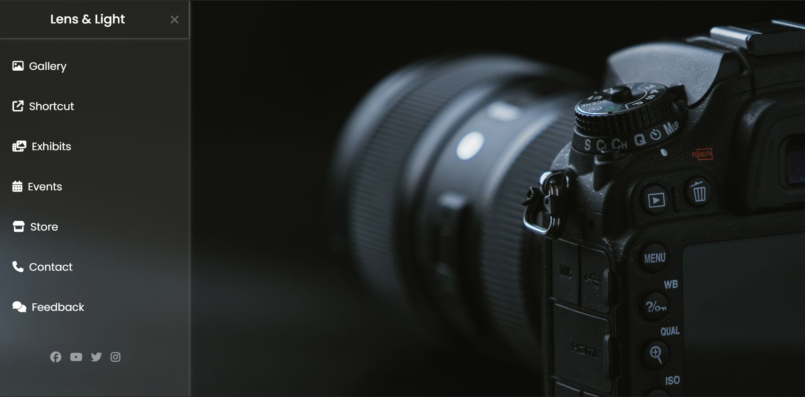

# Lens & Lights

Lens & Lights is a static website homepage created as a frontend practice project using HTML and CSS.  
The goal of this project was to strengthen fundamental web design skills by focusing on layout structure, typography, and visual styling.

The design represents the landing page of a fictional brand named Lens & Lights, with emphasis on clean aesthetics and modern UI elements.

---

## Tech Stack & Tools
- HTML5 – for structuring the webpage  
- CSS3 – for layout, styling, and visual design  
- Google Fonts – for modern and consistent typography  
- Font Awesome – for icons and visual enhancements  

---

## Features
- Static homepage layout
- Custom typography using Google Fonts
- Icon usage with Font Awesome
- Clean and minimal design approach
- Focus on frontend styling and layout practice

---

## Project Purpose
This project was built purely for learning and practice, with the intention of improving:
- HTML structure understanding
- CSS styling and layout skills
- Use of external resources like fonts and icon libraries

---

## Future Improvements
- Make the layout responsive for different screen sizes
- Add additional sections and pages
- Enhance styling with animations and transitions
- Add JavaScript-based interactivity

## Preview

